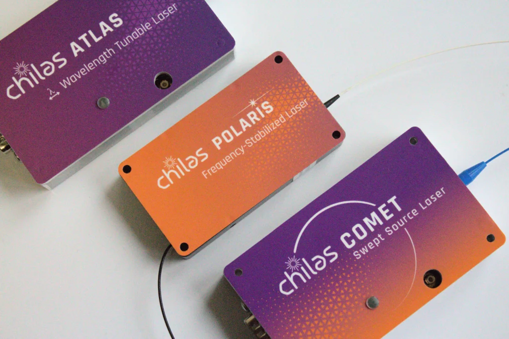

#  PyChilasLasers

Python library for controlling <b>Chilas B.V.</b> narrow-linewidth lasers.

<div align="center">
	
</div>


---

[](https://pypi.org/project/pychilaslasers) 
 


## Overview

PyChilasLasers is a Python interface for laboratory and production control of
Chilas laser devices. It provides:

- High-level, safe abstractions for device communication
- Explicit operating modes (Manual / Steady / Sweep*)
- Calibrated wavelength tuning & optional sweeping (COMET only)
- Utilities for automation and reproducible scripting

---
## Links

- [**Documentation of this library**](TODO)
- [**Quickstart Guide**](http://127.0.0.1:8000/quickstart/)
- [**More information on Chilas laser devices** ](https://chilasbv.com/products/)
- [**Information about Chilas the company**](https://chilasbv.com/about-us/)


## Installation

Using pip (stable release):

```bash
pip install pychilaslasers
```

From source (editable):
```bash
git clone https://github.com/ChilasLasers/PyChilasLasers
cd PyChilasLasers
pip install -e .
```


## Quick Example

Basic connection & wavelength set (see full script in [examples/basic_usage.py](examples/basic_usage.py)):

```python
#Minimal conceptual snippet: see examples for real usage
from pychilaslasers import Laser
laser = Laser("COM_PORT","path/to/calibration/file")
laser.mode = LaserModes.STEADY
laser.steady.wavelength = 1550.00
print(laser.wavelength)
```


## About & Support
<table>
<tr>
<td width="42%" valign="top">

</td>
<td valign="top">
Chilas is a laser manufacturer of widely tunable, narrow linewidth lasers based on state-of-the-art photonic integrated circuit (PIC) technology. With high laser performance delivered by compact modules, Chilas’ lasers power innovations worldwide, enabling cutting-edge applications in coherent optical communication, fiber sensing, LiDAR, quantum key distribution, microwave photonics, and beyond. Chilas is a privately held company (founded 2018) headquartered in Enschede, The Netherlands.
<br>
<br>
	
Primary contact: software@chilas.com  
General info: info@chilas.com  
Issues: GitHub tracker.

</td>
</tr>
</table>

---

Happy tuning!  

Chilas, *Tuned to your wavelength*
