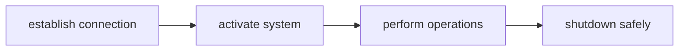

# PyChilasLasers Quickstart Guide

This guide is meant as a starting point for new users to get accustomed to the library,
it's usual operation and help become productive with it quickly. It briefly highlights the library's 
capabilities, then walks through installation, initialization, and a step‑by‑step demo.


## Key Features

**Operating Modes**

- **Steady Mode ([`OperatingMode.STEADY`][pychilaslasers.modes.SteadyMode])** – Uses calibration table entries for precise wavelength tuning.
- **Manual Mode ([`OperatingMode.MANUAL`][pychilaslasers.modes.ManualMode])** – Direct control of individual heater voltages.
- **Sweep Mode ([`OperatingMode.SWEEP`][pychilaslasers.modes.SweepMode])** – High‑speed, high‑resolution sweeping across the calibrated wavelength range.

!!! warning
    Sweep mode (and all sweeping operations) is only available on COMET devices.

**Wavelength Control**

- **Absolute tuning** – Set a specific wavelength in nanometers.
- **Relative tuning** – Apply an offset (step) from the current wavelength.

**Other Features**

- **Trigger pulse generation** for synchronization with external equipment.

---

## Installation

???+ example inline end 
    ```powershell
    > pip install pychilaslasers
    > uv add pychilaslasers
    ```

The `pychilaslasers` library can be installed into the project or computer using 
your python package manager of choice directly from the [Python Package Index Pypi](https://pypi.org/project/pychilaslasers)


## Initialization

With the library installed, connect the laser to the computer and import the library
into the python script to begin using it. The main use of the library is using the 
[`Laser`][pychilaslasers.Laser] class. This class is an abstraction of the laser as 
a python object and encapsulates all of the required logic for operation.


??? info inline end
    The laser can also be initialized without a calibration file restricting it's
    operation to manual mode exclusively. Calibration can be performed later using
    [`Laser.calibrate()`][pychilaslasers.Laser.calibrate].

??? tip "How do you know what com ports are available?"
    The included utils module provides a [`list_comports()`][pychilaslasers.utils.list_comports]
    method that can be used to discover available comports.
    !!! example
        ```python
        >>> from pychilaslasers import utils
        >>> print(utils.list_comports())
        ```

Power the laser on by pressing the side button and turning the key to the right 
position. The yellow LED on the adapter should turn on! Then create a laser instance
by supplying the COM port and calibration file path:


??? example
    ```python
    >>> from pychilaslasers import Laser
    >>> laser = Laser(com_port="COM1", calibration_file="Path/to/calibration/file")
    ```

---

## Quick Start Using the Demo File

The [demo file](https://github.com/ChilasLasers/PyChilasLasers/tree/docs/examples/basic_usage.py) file demonstrates a typical workflow for laser operation.


User prompts are included between operations to allow step-by-step observation of the laser's behavior.


### 1. Initial Setup and Connection


The demo starts by creating an [`Laser`][pychilaslasers.Laser] object and configuring it to communicate
with the hardware on a an available com port queried from the user. The path to 
the provided settings file must be provided by the user for the demo to work.

??? info "Mode selection flexibility"
    You can set the operating mode using the enum, a string, or a mode object—whichever is most convenient.

!!! example
    ```python
    # Instantiate laser
    laser = Laser(com_port=address, calibration_file=fp_lut)

    # Verify connection / system state
    print(f"Connection state: {laser.system_state}")
    ```

### 2. Select Mode & Enable Output

Power the system and select [`SteadyMode`][pychilaslasers.modes.SteadyMode] via its [`LaserMode`][pychilaslasers.modes.LaserMode] value. Steady Mode is the primary mode for ATLAS devices.

!!! example
    ```python
    # Turn system on
    laser.system_state = True

    # Enter steady mode
    laser.mode = mode.LaserMode.STEADY
    ```

### 3. Wavelength Control Examples

Two approaches are demonstrated: setting an absolute wavelength and applying relative (incremental) adjustments.

!!! example
    ```python
    # Absolute set (example value)
    laser.steady.wavelength = 1598.000  # nm

    # Relative increase (+0.004 nm)
    laser.steady.set_wl_relative(0.004)

    # Relative decrease (-1.000 nm)
    laser.steady.set_wl_relative(-1.000)
    ```

### 4. Monitor Current Wavelength

Access the current wavelength directly via the steady mode interface:

!!! example
    ```python
    print(f"Current wavelength: {laser.steady.wavelength} nm")
    ```

### 5. COMET‑Only Features (Sweep Mode)

On COMET devices, the script optionally runs the [sweeping demo](https://github.com/ChilasLasers/PyChilasLasers/tree/docs/examples/basic_usage_sweeping.py) showcasing Sweep Mode.

!!! tip "Not using a COMET? You can skip this section."

Switch to Sweep Mode (string form shown here):

??? example
    ```python
    laser.mode = "sweeping"
    ```

Sweep Mode exposes two categories of wavelength bounds:

1. Device limits (`min_wavelength`, `max_wavelength`)
2. Active sweep range (`start_wavelength`, `end_wavelength`)

Both of these can be accessed as python proprieties


!!! example
    ```python
    start_wavelength: float = laser.sweep.start_wavelength
    end_wavelength: float = laser.sweep.end_wavelength

    laser.sweep.start_wavelength = 1508

    # Device capability limits
    min_wl = laser.sweep.min_wavelength
    max_wl = laser.sweep.max_wavelength
    ```

You can also configure the sweep interval (time between successive wavelengths) and control execution with [`start()`][pychilaslasers.modes.SweepMode.start] / [`stop()`][pychilaslasers.modes.SweepMode.stop].

---

## Additional Capabilities

Beyond wavelength tuning and sweeping, PyChilasLasers provides:

- Manual heater control
- Trigger pulse generation
- Anti‑hysteresis algorithms
- Temperature monitoring

Continue exploring in the [Package Reference](/package) section for comprehensive API documentation.

